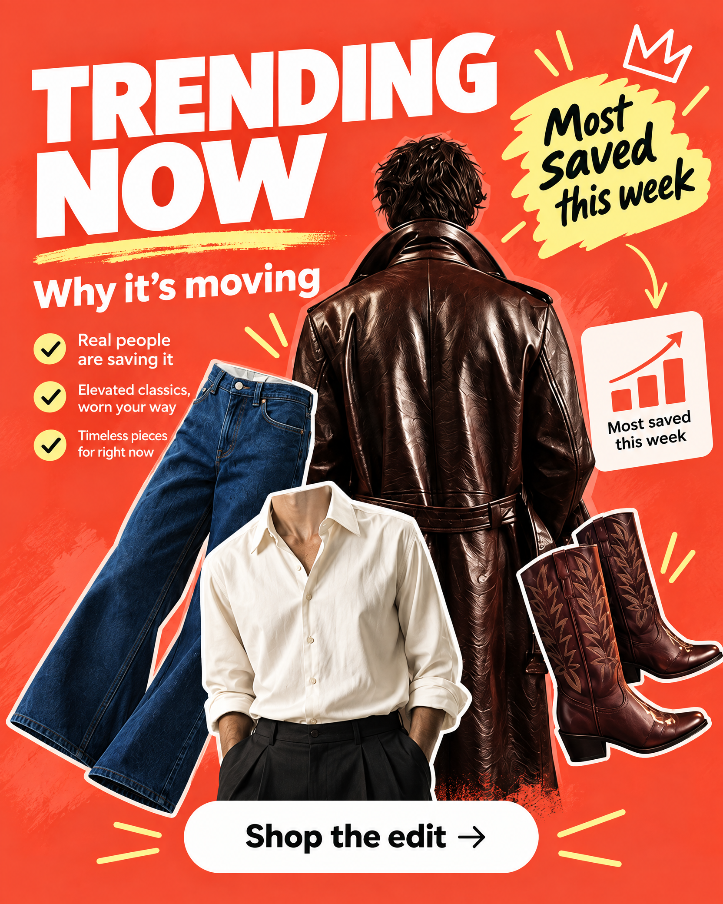
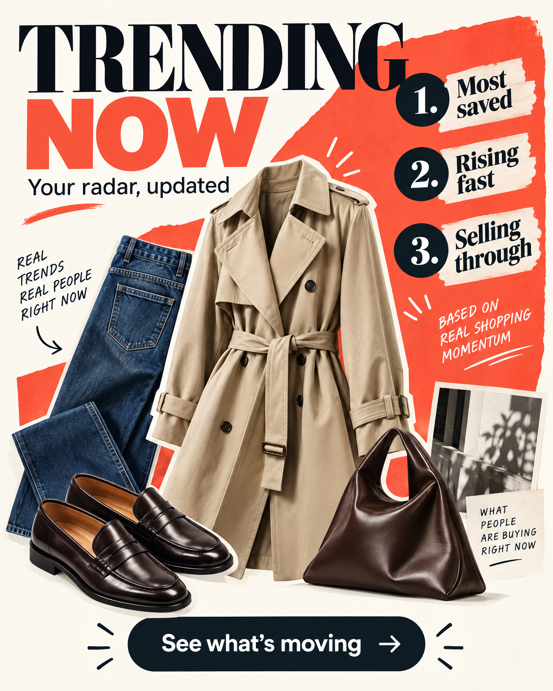

# Trending Now — visual mock-up plan

**Branch:** `fix/social-share-sheet-stable`  
**Surface:** Today feed editorial poster carousel  
**Status:** Concept exploration; no production UI behavior changed yet

## Design goal

Make **Trending Now** immediately understandable and high-quality at a glance:

1. **What it is:** a curated edit of items showing momentum on Uvel.
2. **Why it matters:** the user can understand the signal behind the edit instead of seeing a generic fashion collage.
3. **What to do next:** the poster is clearly tappable and leads to a shoppable story.
4. **Quality bar:** sharp, legible typography; clean product edges; intentional spacing; no crowded or ambiguous decoration; credible editorial art direction.

The current implementation already supports the interaction model: the poster opens `TodayBannerStoryOverlay`, and the underlying selection is based on views plus likes (`views + likedBy.length * 8`). The visual work should expose that value without turning the card into an analytics dashboard.

## Concept A — Coral momentum poster

### Intent

Keep the recognizable coral/red Uvel editorial energy from the current poster, but make the trend rationale and CTA explicit.

### Proposed hierarchy

- **Eyebrow:** `TREND EDIT`
- **Headline:** `TRENDING NOW`
- **Reason:** `Why it’s moving`
- **Signal badge:** `Most saved this week`
- **CTA:** `Shop the edit`
- **Product collage:** 3–4 cutouts with one hero item and a clear foreground/background relationship

### Strengths

- Closest to the existing asset, so it should feel like a safe evolution.
- Coral field remains visually distinctive in the carousel.
- The “Most saved this week” badge gives the poster a concrete reason to open.
- Strongest option for fast recognition and conversion.

### Watch-outs

- Avoid adding too many handwritten callouts; they can compete with the headline.
- Keep the CTA in a high-contrast pill or anchored footer zone so it reads as an action, not decoration.

## Concept B — Ranked radar poster

### Intent

Make the evidence behind “trending” more explicit through a restrained ranked list, while keeping the result fashion-forward rather than spreadsheet-like.

### Proposed hierarchy

- **Eyebrow:** `UVEL RADAR`
- **Headline:** `TRENDING NOW`
- **Framing line:** `Your radar, updated`
- **Signal rows:**
  - `1. Most saved`
  - `2. Rising fast`
  - `3. Selling through`
- **CTA:** `See what’s moving`
- **Product collage:** 3–4 cutouts aligned to the ranked story

### Strengths

- Most clearly communicates that “trending” is based on observable momentum.
- Gives users a reason to trust the edit without showing raw numbers.
- Creates a reusable visual system for future trend categories.

### Watch-outs

- The ranked copy must stay short and large enough for a small phone card.
- If the app cannot support “selling through” as a reliable signal, replace it with a supported phrase such as `Getting attention`.

## Recommendation

Start with **Concept A** for the production iteration. It preserves the current poster’s identity while fixing the main clarity gap: users can see both the trend reason and the next action. Keep Concept B as the follow-up system direction if product wants more explicit trend explanation.

## Production implementation plan

1. **Replace the reference asset** used for `story.id === "trending-now"` with the approved concept asset.
2. **Keep the current tap behavior** that opens the full story overlay; do not add a second competing interaction inside the poster.
3. **Use one supported signal label** in the artwork. The current ranking logic is views plus likes, so `Most saved this week` should only ship if the copy is backed by an agreed product metric; otherwise use `Uvel is watching right now` or `Getting attention now`.
4. **Preserve the existing poster constraints:** approximately 4:5 composition, rounded 22px card treatment, full-bleed image, and carousel auto-advance.
5. **Validate at three sizes:** small phone width, standard phone width, and a large phone width. Headline, signal badge, and CTA must remain readable without relying on zoom.
6. **Accessibility:** retain the existing `Open Trending Now editorial` button label and add a concise visual description to the design handoff so the image is not the only source of meaning.

## Acceptance checklist

- [ ] “Trending Now” is the first readable message.
- [ ] The user can tell why the edit exists within one second.
- [ ] The shopping action is visually distinct from decorative text.
- [ ] Product cutouts are crisp and do not collide with the headline or CTA.
- [ ] Typography remains legible at the smallest supported poster size.
- [ ] The visual feels like Uvel, but is not a near-duplicate of the current poster.
- [ ] The signal language matches data Uvel can actually support.
- [ ] The poster still reads correctly when the carousel auto-advances.
