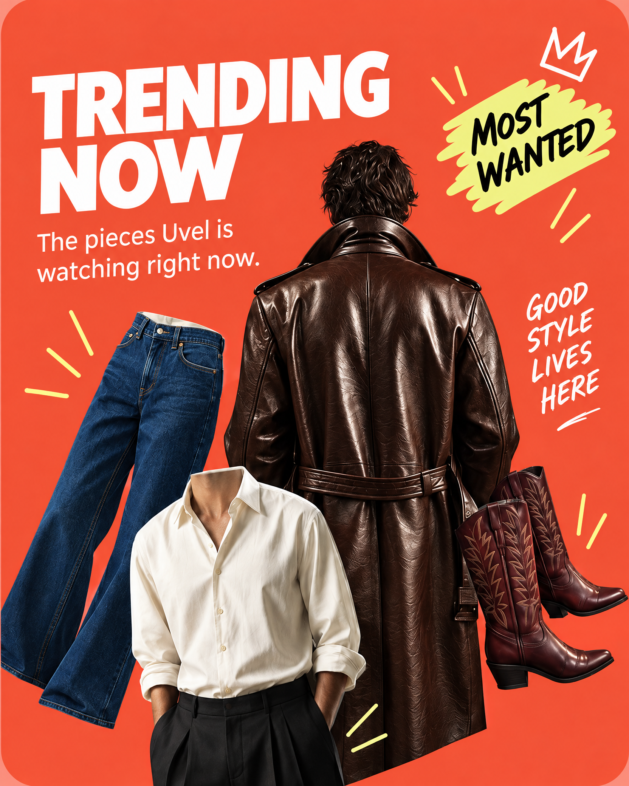

# Trending Now — visual refinement plan

**Branch:** `fix/social-share-sheet-stable`  
**Surface:** Today feed editorial poster carousel  
**Status:** Refined visual mock-up; production UI behavior unchanged

## Direction

Keep the **current Today Trending Now poster** as the source of truth. This is a polish pass, not a new layout or a new trend-ranking system.

Preserve:

- The coral-red full-bleed background
- The large white `TRENDING NOW` headline
- The supporting copy: `The pieces Uvel is watching right now.`
- The `MOST WANTED` callout and crown
- The `GOOD STYLE LIVES HERE` handwritten note
- The same fashion collage: leather jacket, denim, cream shirt, and boots
- The existing 4:5 poster shape and tap-to-open story behavior

Improve:

- Typography sharpness and spacing
- Product cutout edges and masking
- Contrast between copy and background
- Consistency of the hand-drawn marks
- Texture and finish of the fashion imagery
- Legibility when the card is viewed at small phone size
- Overall balance so the headline, collage, and callouts feel intentional rather than crowded

## Refined mock-up

The refined version intentionally does **not** add a new CTA button, numbered trend rows, analytics language, or a different color system. The poster should still feel instantly familiar to someone using Today now.

## Implementation plan

1. Replace the reference asset used for `story.id === "trending-now"` with the approved refined poster.
2. Keep the existing `TodayBannerStoryOverlay` interaction and carousel auto-advance unchanged.
3. Keep the current `Trending Now` data behavior unchanged: available cutouts ranked by views and likes.
4. Validate the poster at small, standard, and large phone widths. The headline, supporting copy, and callouts must remain readable without zooming.
5. Keep the existing accessibility label: `Open Trending Now editorial`.

## Quality acceptance checklist

- [ ] It looks unmistakably like the current Today Trending Now poster.
- [ ] No new visual system or layout is introduced.
- [ ] `TRENDING NOW` is the first readable message.
- [ ] Existing copy is preserved and legible.
- [ ] Product edges look clean at both full resolution and card size.
- [ ] The coral field, white type, yellow callout, and handwritten marks feel cohesive.
- [ ] The poster remains clear while the carousel auto-advances.
- [ ] The image still feels editorial, premium, and distinctly Uvel.
